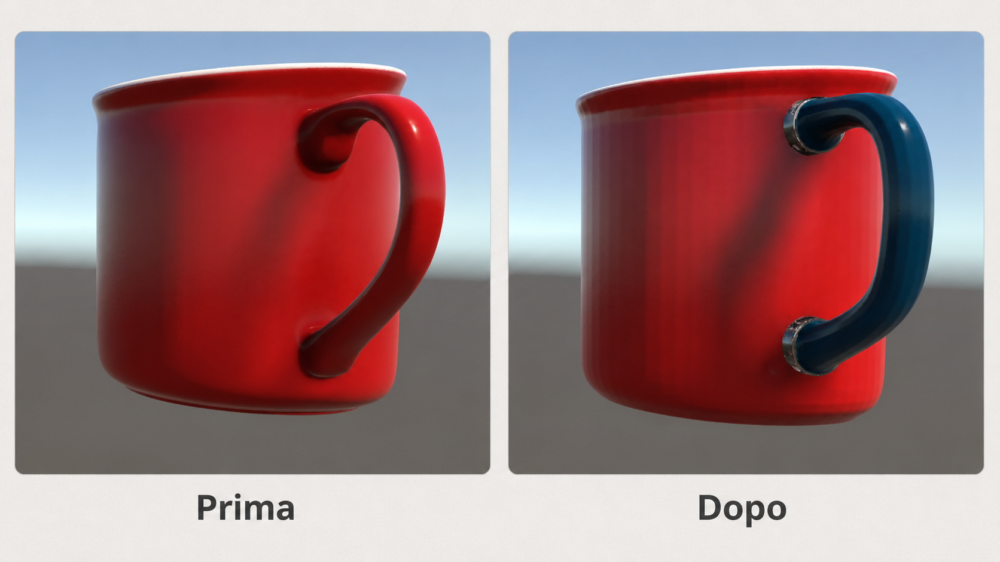
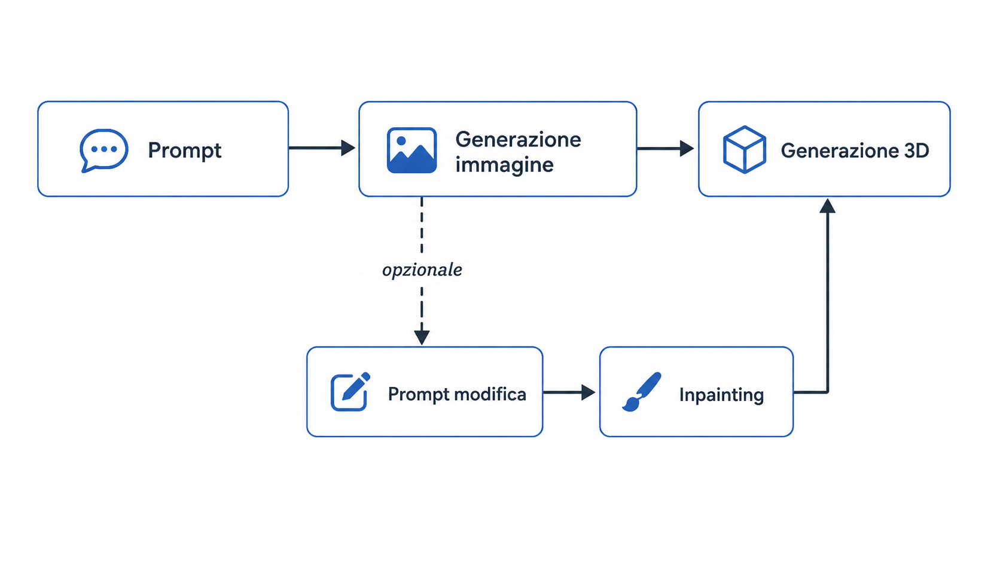
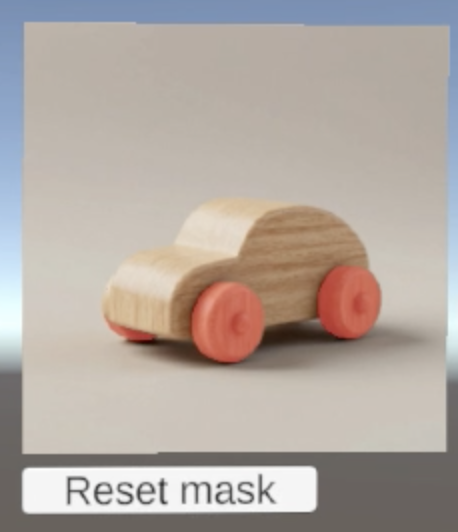
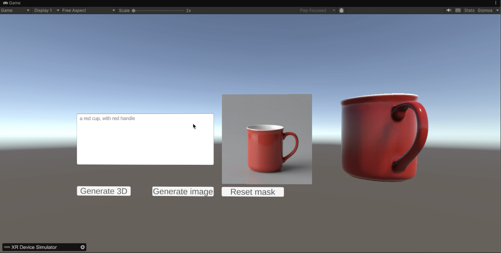
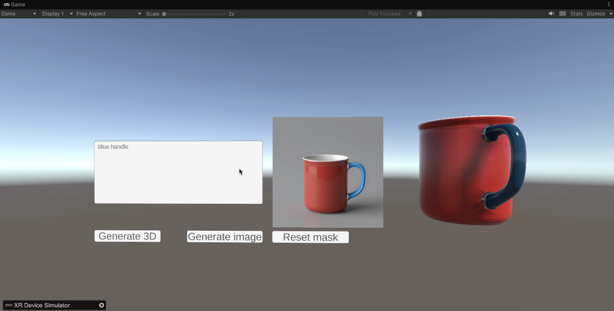

# Image-to-3D Refinement

<p align="center">
  <strong>Pipeline interattiva per generare, modificare e ricostruire asset 3D a partire da prompt e immagini.</strong>
</p>

<p align="center">
  Unity + OpenXR · Flask · Z-Image Turbo · SAM2 · TRELLIS.2 · glTFast
</p>

<p align="center">
  
</p>

> Progetto accademico sviluppato per il corso di **Computer Graphics e Multimedia** dell'Università Politecnica delle Marche, A.A. 2025-2026.

## Indice

- [Panoramica](#panoramica)
- [Funzionalità](#funzionalità)
- [Workflow](#workflow)
- [Struttura del repository](#struttura-del-repository)
- [Tecnologie e versioni](#tecnologie-e-versioni)
- [Requisiti](#requisiti)
- [Installazione del backend](#installazione-del-backend)
- [Configurazione del file `.env`](#configurazione-del-file-env)
- [Avvio del server](#avvio-del-server)
- [Configurazione di Unity](#configurazione-di-unity)
- [Utilizzo](#utilizzo)
- [API REST](#api-rest)
- [Output](#output)
- [Limitazioni note](#limitazioni-note)
- [Sviluppi futuri](#sviluppi-futuri)
- [Relazione e autori](#relazione-e-autori)

## Panoramica

**Image-to-3D Refinement** è un prototipo client-server che permette di:

1. generare un concept 2D da un prompt testuale;
2. selezionare una regione dell'immagine manualmente oppure tramite SAM2;
3. modificare la regione selezionata con una pipeline di inpainting;
4. ricostruire un modello tridimensionale a partire dall'immagine finale;
5. esportare il risultato in formato `.glb` e visualizzarlo dinamicamente in Unity.

Il client Unity gestisce l'interfaccia, l'interazione, il rendering e il caricamento del modello 3D. Il backend Flask esegue le operazioni computazionalmente più pesanti, mantiene i modelli in memoria e salva immagini, maschere e modelli nella cartella `Server/runs/`.

Il progetto è predisposto per OpenXR e XR Interaction Toolkit, ma durante lo sviluppo è stato verificato principalmente in **Play Mode nell'Unity Editor**, usando la simulazione XR e l'interazione desktop. La build standalone su visore non è ancora stata validata.

## Funzionalità

- Generazione Text-to-Image con **Z-Image Turbo** tramite nodi ComfyUI.
- Disegno manuale della maschera direttamente sopra l'immagine in Unity.
- Segmentazione interattiva point-based con **SAM2**.
- Supporto a più regioni SAM2 aggiunte alla stessa maschera.
- Inpainting locale guidato da maschera e prompt testuale.
- Generazione Image-to-3D con **TRELLIS.2**.
- Esportazione del risultato in formato `.glb`.
- Download e caricamento runtime del modello tramite **glTFast**.
- API REST per usare il backend anche senza il client Unity.

## Workflow

<p align="center">
  
</p>

Il flusso principale è:

```text
Prompt
  └──> Generazione immagine
         ├──> Generazione 3D diretta
         └──> Selezione maschera
                ├──> Maschera manuale
                └──> Segmentazione SAM2
                       └──> Inpainting
                              └──> Generazione 3D
                                     └──> Download e visualizzazione GLB in Unity
```

Esempio di selezione automatica tramite SAM2:

<p align="center">
  
</p>


### Client Unity

Il client contiene la scena, l'interfaccia e gli script C# che gestiscono:

- invio del prompt al server;
- download e visualizzazione dell'immagine;
- disegno della maschera;
- richiesta di segmentazione SAM2;
- richiesta di inpainting;
- richiesta di generazione 3D;
- download del file `.glb`;
- caricamento e posizionamento del modello nella scena.

Lo script principale è `Unity/Assets/Scripts/ImageGeneratorClient.cs`.

### Backend Flask

`Server/app.py` espone le API e coordina quattro servizi:

- `ImageGenerationService`: generazione immagini;
- `InpaintService`: modifica locale dell'immagine;
- `SAM2SegmentationService`: segmentazione guidata da punti o bounding box;
- `Model3DGenerationService`: generazione del modello 3D.

## Struttura del repository

```text
.
├── Unity/
│   ├── Assets/
│   │   ├── Scenes/
│   │   │   └── Model3D.unity
│   │   └── Scripts/
│   │       ├── ImageGeneratorClient.cs
│   │       ├── ImageInpaintingClient.cs
│   │       ├── ImageMaskPainter.cs
│   │       ├── SAM2SegmentationClient.cs
│   │       ├── DisableXRSimulatorWhileTyping.cs
│   │       └── SimpleEditorXRLook.cs
│   ├── Packages/
│   └── ProjectSettings/
├── Server/
│   ├── app.py
│   ├── services/
│   │   ├── comfyui_bootstrap.py
│   │   ├── image_service.py
│   │   ├── edit_service2.py
│   │   ├── sam2_service.py
│   │   └── model3d_service.py
│   ├── utils/
│   │   └── storage.py
│   ├── runs/                  # output runtime, da non versionare
│   ├── models/                # cache locali, da non versionare
│   ├── checkpoints/           # checkpoint locali, da non versionare
│   └── .env.example
├── docs/
│   ├── Graphics.pdf
│   └── images/
├── requirements.txt
└── README.md
```

## Tecnologie e versioni

### Unity

- Unity `6000.4.3f1`
- Universal Render Pipeline `17.4.0`
- Input System `1.19.0`
- XR Interaction Toolkit `3.4.1`
- XR Plugin Management `4.6.0`
- OpenXR Plugin `1.16.1`
- glTFast da repository GitHub

Le dipendenze vengono ripristinate automaticamente dal file `Unity/Packages/manifest.json`.

### Backend

- Python e Flask
- PyTorch `2.6.0 + CUDA 12.4`
- torchvision `0.21.0 + CUDA 12.4`
- ComfyUI
- Z-Image Turbo
- Qwen text encoder
- SAM2
- TRELLIS.2
- Pillow, NumPy, OpenCV, rembg e altre dipendenze elencate in `requirements.txt`

> La versione Python non è fissata nel repository. Per riprodurre l'ambiente è preferibile usare la stessa versione del container GPU impiegato nello sviluppo oppure una versione compatibile con PyTorch 2.6, ComfyUI e TRELLIS.2.

## Requisiti

### Hardware consigliato

- Sistema Linux per il backend.
- GPU NVIDIA compatibile con CUDA.
- VRAM sufficiente per TRELLIS.2 e per i modelli immagine.
- Spazio disco adeguato per checkpoint e cache Hugging Face.

TRELLIS.2 è il componente più pesante della pipeline. Con memoria GPU insufficiente, la generazione 3D può terminare con un errore CUDA out-of-memory.

### Software

- Git.
- Python con `pip`.
- Driver NVIDIA e CUDA compatibili con PyTorch `cu124`.
- Unity Hub.
- Unity Editor `6000.4.3f1`.
- Copia locale o installazione accessibile di ComfyUI.
- Copia locale di SAM2 e relativo checkpoint.
- Copia locale di TRELLIS.2 oppure cache dei modelli disponibile.

### File non inclusi nel repository

Per motivi di dimensione e licenza, il repository non contiene:

- checkpoint Z-Image;
- text encoder Qwen;
- VAE;
- checkpoint SAM2;
- pesi TRELLIS.2;
- cache Hugging Face;
- output contenuti in `Server/runs/`;
- token e segreti del file `.env`.

## Installazione del backend

### Repository e ambiente Python

Il repository si può scaricare con:

```bash
git clone https://github.com/niccolociotti/image-to-3d-refinement.git
cd image-to-3d-refinement
```

L'ambiente originale del progetto gira in un container GPU già configurato. In locale va bene anche un virtual environment, a patto che la versione Python sia compatibile con PyTorch, ComfyUI e TRELLIS.2:

```bash
python -m venv .venv
source .venv/bin/activate
python -m pip install --upgrade pip
pip install -r requirements.txt
```

Su Windows PowerShell:

```powershell
python -m venv .venv
.\.venv\Scripts\Activate.ps1
python -m pip install --upgrade pip
pip install -r requirements.txt
```

> `requirements.txt` installa le dipendenze Python principali, ma non sostituisce la configurazione specifica richiesta da ComfyUI e TRELLIS.2.

### ComfyUI

Il backend cerca ComfyUI:

1. nel path indicato da `COMFYUI_PATH`;
2. nella root `Server/` con uno dei nomi `ComfyUI`, `comfyui`, `ComfyUi` o `comfui`.

La configurazione più semplice usa un path esplicito nel file `.env`:

```env
COMFYUI_PATH=/absolute/path/to/ComfyUI
```

Questi file devono essere visibili ai loader di ComfyUI:

```text
z-image-turbo-fp8-e4m3fn.safetensors
qwen_3_4b.safetensors
ae.safetensors
```

I nomi si possono modificare tramite le variabili `Z_IMAGE_CHECKPOINT`, `Z_IMAGE_CLIP` e `Z_IMAGE_VAE`.

### SAM2

SAM2 può arrivare dalla dipendenza Git già presente in `requirements.txt` oppure da una copia locale del repository. Al backend servono:

- il package/repository SAM2;
- il file di configurazione del modello;
- il checkpoint `sam2.1_hiera_base_plus.pt`.

Esempio:

```text
/path/to/sam2/
├── sam2/
├── configs/
└── checkpoints/
    └── sam2.1_hiera_base_plus.pt
```

### TRELLIS.2

TRELLIS.2 richiede una configurazione separata in ambiente Linux con CUDA. Il backend cerca la directory nel path indicato da `TRELLIS2_PATH` e carica il modello `microsoft/TRELLIS.2-4B`, oppure una snapshot locale specificata tramite `TRELLIS2_LOCAL_SNAPSHOT`.

Il progetto usa di default il profilo `1024` per contenere il consumo di memoria e i tempi di inferenza.

## Configurazione del file `.env`

La configurazione locale del backend viene letta da:

```text
Server/.env
```

Il file di esempio incluso nel repository può essere copiato così:

```bash
cp Server/.env.example Server/.env
```

`Server/.env` resta escluso da Git, perché può contenere token e percorsi locali.

Esempio completo:

```env
# ============================================================
# Flask
# ============================================================
SERVER_AUTO_SHUTDOWN_SECONDS=0

# ============================================================
# ComfyUI / Z-Image
# ============================================================
COMFYUI_PATH=/absolute/path/to/ComfyUI
Z_IMAGE_CHECKPOINT=z-image-turbo-fp8-e4m3fn.safetensors
Z_IMAGE_CLIP=qwen_3_4b.safetensors
Z_IMAGE_VAE=ae.safetensors
DISABLE_COMFY_KITCHEN=0

# ============================================================
# SAM2
# ============================================================
SAM2_PATH=/absolute/path/to/sam2
SAM2_CHECKPOINT=/absolute/path/to/sam2.1_hiera_base_plus.pt
SAM2_CHECKPOINT_DIR=
SAM2_MODEL_CFG=configs/sam2.1/sam2.1_hiera_b+.yaml
SAM2_DEVICE=auto
SAM2_RETURN_BASE64_BY_DEFAULT=0

# ============================================================
# TRELLIS.2
# ============================================================
TRELLIS2_PATH=/absolute/path/to/TRELLIS.2
TRELLIS2_MODEL_ID=microsoft/TRELLIS.2-4B
TRELLIS2_DEVICE=cuda
TRELLIS2_PIPELINE_TYPE=512
TRELLIS2_MAX_NUM_TOKENS=32768
TRELLIS2_DECIMATION_TARGET=250000
TRELLIS2_TEXTURE_SIZE=1024
TRELLIS2_SIMPLIFY_LIMIT=4000000
TRELLIS2_REMESH=0
TRELLIS2_EXTENSION_WEBP=0
TRELLIS2_REMBG_MODEL_NAME=ZhengPeng7/BiRefNet

TRELLIS2_CACHE_DIR=/absolute/path/to/trellis_cache
TRELLIS2_LOCAL_SNAPSHOT=

# Token Hugging Face opzionale.
HF_TOKEN=
HUGGINGFACE_HUB_TOKEN=
```

### Variabili principali

| Variabile | Descrizione | Default |
|---|---|---|
| `COMFYUI_PATH` | Directory di ComfyUI | ricerca automatica |
| `Z_IMAGE_CHECKPOINT` | Checkpoint generazione/inpainting | `z-image-turbo-fp8-e4m3fn.safetensors` |
| `Z_IMAGE_CLIP` | Text encoder | `qwen_3_4b.safetensors` |
| `Z_IMAGE_VAE` | VAE | `ae.safetensors` |
| `SAM2_PATH` | Directory SAM2 | ricerca automatica |
| `SAM2_CHECKPOINT` | Checkpoint SAM2 | ricerca automatica |
| `SAM2_MODEL_CFG` | Configurazione SAM2 | `configs/sam2.1/sam2.1_hiera_b+.yaml` |
| `SAM2_DEVICE` | `auto`, `cuda`, `mps` o `cpu` | `auto` |
| `TRELLIS2_PATH` | Directory TRELLIS.2 | ricerca automatica |
| `TRELLIS2_MODEL_ID` | Modello Hugging Face | `microsoft/TRELLIS.2-4B` |
| `TRELLIS2_DEVICE` | Device della pipeline 3D | `cuda` |
| `TRELLIS2_PIPELINE_TYPE` | Profilo di inferenza | `1024` |
| `TRELLIS2_CACHE_DIR` | Cache TRELLIS/Hugging Face | `Server/models/trellis_cache` |
| `HF_TOKEN` | Token Hugging Face opzionale | vuoto |

## Avvio del server

### Installazione locale

Dalla root del repository:

```bash
cd Server
python app.py
```

Il server ascolta su:

```text
http://0.0.0.0:8081
```

Lo stato del server si controlla con:

```bash
curl http://127.0.0.1:8081/health
```

Risposta attesa:

```json
{
  "status": "ok"
}
```

### Container usato durante lo sviluppo

Nell'ambiente universitario il backend veniva eseguito in un container GPU già predisposto:

```bash
docker restart cg2026-gr4-GPU1
docker exec -it cg2026-gr4-GPU1 bash
cd /app/Progetto-CG/Server
python app.py
```

Il nome del container e il percorso dipendono naturalmente dall'ambiente in uso.

## Configurazione di Unity

### Apertura del progetto

Il progetto Unity si trova nella cartella `Unity/` e usa la versione `6000.4.3f1`. Da Unity Hub basta aggiungere quella cartella come progetto; al primo avvio Unity ripristina automaticamente i package. La scena principale è:

```text
Unity/Assets/Scenes/Model3D.unity
```

### Configurazione degli endpoint

Gli endpoint del backend sono esposti nel componente `ImageGeneratorClient`, nella sezione **Impostazioni Server** dell'Inspector. Una configurazione locale tipica è questa:

Esempio con backend locale:

```text
Server Url Image:         http://127.0.0.1:8081/generate-image
Server Url Edit Image:    http://127.0.0.1:8081/edit-image
Server Url Segment Image: http://127.0.0.1:8081/segment-image
Server Url 3D:            http://127.0.0.1:8081/generate-3d
Session Id:               test
```

Nel codice possono comparire URL con l'indirizzo IP privato usato durante lo sviluppo; nell'Inspector vanno quindi indicati gli indirizzi corretti per la rete attuale.

Quando Unity e Flask girano su macchine diverse, negli URL serve l'IP LAN del server GPU. La porta `8081` deve essere raggiungibile e firewall, VPN o rete locale possono influire sulla connessione. In questo caso `127.0.0.1` non va bene, perché indica la macchina su cui gira Unity.

### Modalità SAM2 e maschera manuale

Il campo `useSam2Masking` controlla la modalità di selezione:

- `true`: il click sull'immagine viene inviato a SAM2;
- `false`: l'utente disegna manualmente sull'overlay.

Altri parametri disponibili:

- `sam2AddToExistingMask`: aggiunge la nuova regione alla maschera esistente;
- `sam2SelectionMode`: selezione `part`, `largest` o basata sullo score;
- `sam2GrowMaskBy`: espansione della maschera;
- `sam2MaskBlur`: sfocatura della maschera.

### Test senza visore

Il progetto include strumenti per testare l'applicazione nell'Editor:

- XR Device Simulator;
- movimento della visuale tramite mouse;
- disattivazione automatica del simulatore mentre si scrive nel campo di testo.

## Utilizzo

### Generazione diretta

Con il backend attivo e la scena Unity in Play Mode, nel campo di testo si può inserire un prompt come:

```text
a red cup, with red handle
```

Il pulsante **Generate Image** invia il prompt al backend e mostra il risultato nella `RawImage`. Usando poi **Generate 3D** senza una maschera, Unity scarica il file `.glb` e lo mostra accanto all'immagine.

<p align="center">
  
</p>

### Generazione dopo inpainting

Dopo la prima generazione, la regione da modificare può essere selezionata a mano oppure con un click quando SAM2 è attivo. Il campo del prompt viene poi riutilizzato per descrivere la modifica, per esempio:

```text
blue handle
```

Con **Generate 3D**, il client passa prima da `/edit-image` e poi da `/generate-3d`. Alla fine, nella scena compaiono sia l'immagine modificata sia il modello 3D risultante.

<p align="center">
  
</p>

## API REST

### Endpoint disponibili

| Metodo | Endpoint | Funzione |
|---|---|---|
| `GET` | `/health` | Verifica lo stato del server |
| `GET` | `/files/<path>` | Scarica gli output presenti in `Server/runs/` |
| `POST` | `/generate-image` | Genera un'immagine da prompt |
| `POST` | `/segment-image` | Genera una maschera tramite SAM2 |
| `POST` | `/edit-image` | Esegue l'inpainting di una regione |
| `POST` | `/generate-3d` | Genera un modello `.glb` da un'immagine |

### `GET /health`

```bash
curl http://127.0.0.1:8081/health
```

```json
{
  "status": "ok"
}
```

### `POST /generate-image`

```bash
curl -X POST http://127.0.0.1:8081/generate-image \
  -H "Content-Type: application/json" \
  -d '{
    "session_id": "demo",
    "prompt": "a red cup, with red handle",
    "negative_prompt": "blurry, ugly, bad, background",
    "width": 1024,
    "height": 1024,
    "steps": 9,
    "cfg": 1.0,
    "seed": 0
  }'
```

Risposta tipica:

```json
{
  "status": "ok",
  "image_path": "/absolute/path/to/Server/runs/demo/generated_123.png",
  "image_url": "http://127.0.0.1:8081/files/demo/generated_123.png"
}
```

### `POST /segment-image`

Esempio con un punto in coordinate pixel:

```bash
curl -X POST http://127.0.0.1:8081/segment-image \
  -H "Content-Type: application/json" \
  -d '{
    "session_id": "demo",
    "image_path": "/absolute/path/to/Server/runs/demo/generated_123.png",
    "points": [
      {"x": 500, "y": 500, "label": 1}
    ],
    "multimask_output": true,
    "selection_mode": "part",
    "coordinates_normalized": false,
    "return_base64": true
  }'
```

Parametri principali:

- `points`: lista di punti positivi o negativi;
- `box`: bounding box opzionale `[x1, y1, x2, y2]`;
- `label`: `1` per includere, `0` per escludere;
- `selection_mode`: `part`, `largest` oppure selezione tramite score;
- `mask_index`: forza una maschera specifica;
- `grow_mask_by`: espande la regione;
- `mask_blur`: sfuma i bordi;
- `invert_mask`: inverte la maschera;
- `coordinates_normalized`: usa coordinate tra `0` e `1` quando impostato a `true`.

### `POST /edit-image`

```bash
curl -X POST http://127.0.0.1:8081/edit-image \
  -H "Content-Type: application/json" \
  -d '{
    "session_id": "demo",
    "image_path": "/absolute/path/to/Server/runs/demo/generated_123.png",
    "mask_path": "/absolute/path/to/Server/runs/demo/mask.png",
    "prompt": "blue handle",
    "steps": 30,
    "cfg": 8.0,
    "denoise": 0.8,
    "grow_mask_by": 2,
    "mask_blur": 1.0,
    "mask_threshold": 128,
    "invert_mask": false
  }'
```

È possibile inviare la maschera anche tramite `mask_base64` al posto di `mask_path`.

### `POST /generate-3d`

```bash
curl -X POST http://127.0.0.1:8081/generate-3d \
  -H "Content-Type: application/json" \
  -d '{
    "session_id": "demo",
    "image_path": "/absolute/path/to/Server/runs/demo/inpainted_456.png"
  }'
```

Risposta tipica:

```json
{
  "status": "ok",
  "model3d_path": "/absolute/path/to/Server/runs/demo/model3d_123456.glb",
  "model3d_url": "http://127.0.0.1:8081/files/demo/model3d_123456.glb"
}
```

## Output

Gli output vengono organizzati per sessione:

```text
Server/runs/<session_id>/
├── generated_<seed>.png
├── mask.png
├── inpainted_<seed>.png
└── model3d_<timestamp>_<id>.glb
```

Se `session_id` non viene fornito, il backend crea automaticamente un identificatore UUID.

La rotta `/files/<path>` rende accessibili al client i file salvati sotto `Server/runs/`.


## Limitazioni note

- Il progetto è un prototipo accademico e non un servizio pronto per la produzione.
- La build standalone su visore OpenXR non è stata ancora validata.
- Le maschere troppo estese possono produrre risultati di inpainting instabili.
- Piccole variazioni del prompt possono cambiare sensibilmente il risultato.
- Il modello può ignorare la modifica, eliminare la regione oppure alterarne la forma.
- TRELLIS.2 richiede molta memoria GPU e tempi di inferenza elevati.
- Il profilo 3D più leggero riduce i tempi ma comporta una perdita di dettaglio.
- I path restituiti dalle API sono path locali del server e non sono portabili tra macchine.

## Sviluppi futuri

- Validazione e build standalone su visori OpenXR.
- Input vocale tramite Speech-to-Text.
- Manipolazione diretta del modello generato nello spazio 3D.
- Possibilità di annullare una generazione in corso.
- Dockerfile e `docker-compose.yml` riproducibili.
- Supporto a nuove pipeline Image-to-3D.

## Relazione e autori

La relazione completa è disponibile in:

[`docs/Graphics.pdf`](docs/Graphics.pdf)

### Autori

- **Niccolò Ciotti**
- **Luca Renzi**
- **Antonio Di Placido**

Università Politecnica delle Marche  
Facoltà di Ingegneria  
Corso di Laurea in Ingegneria Informatica e dell'Automazione  
Corso di Computer Graphics e Multimedia  
Anno Accademico 2025-2026
